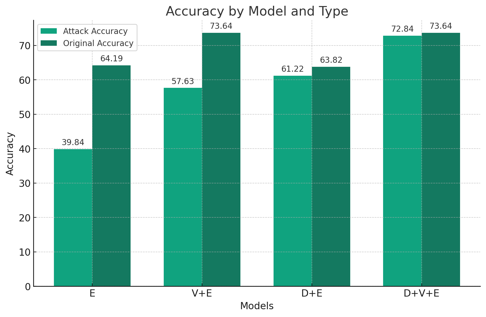
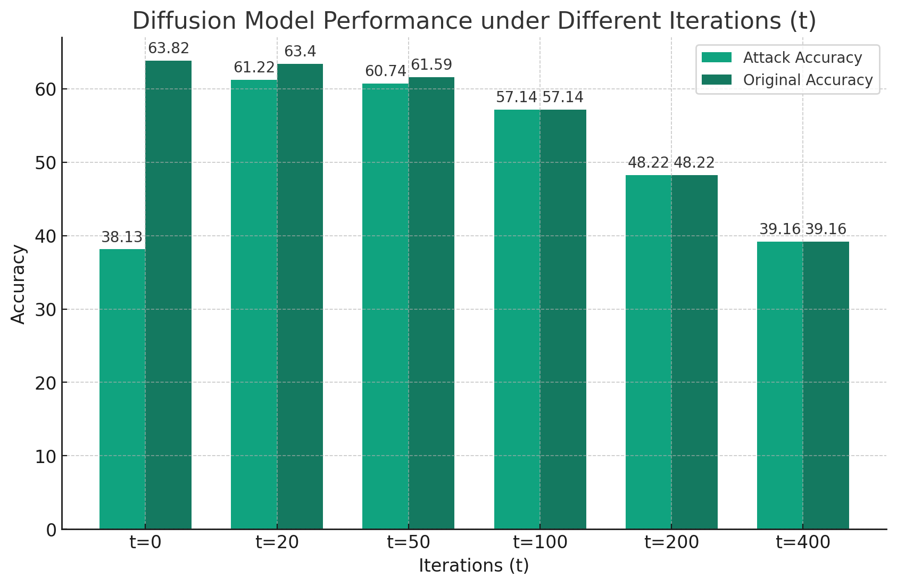

#Readme
## Modified VOneNet very Robust
This project is build based on CS2470 research, the foolproof eyes. In extend to it, we build another diffusion model and incorperate them together to genereate a better robustness result.
E stands for EfficientNet.
V stands for VOneNet.
D stands for Diffusion Model.

Diffustion and EfficientNet accuracy under different t:

VOneNet under different number of Gabor Filters (GF):

The dataset required:

The previous research on the VOneNet can be found in this link:
https://devpost.com/software/csci2470-final-project

