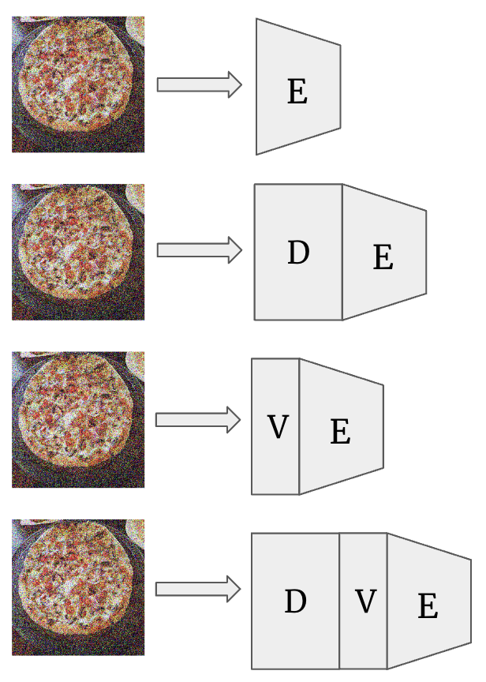
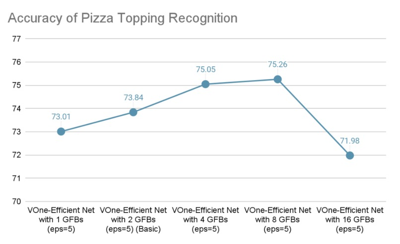

#Readme
## Modified VOneNet very Robust
This project is build based on CS2470 research, the foolproof eyes. In extend to it, we build another diffusion model and incorperate them together to genereate a better robustness result.\

E stands for EfficientNet.

V stands for VOneNet.

D stands for Diffusion Model.

Diffustion and EfficientNet accuracy under different t:

For our experimental setting, we picked t=20 for its clear performance on the original image as well as a minimum trade-off between robustness and accuracy.

VOneNet under different number of Gabor Filters (GF):

For our experimental setting, we picked GF number to be 8 for compromised training accuracy and runtime.

To run this project, make sure pictures under the directory attack_input is fine. Github theoratically doesn't encourage us to upload large files, so the set here is just a simplfied version of test data. For full adversarial attack input, please contact author at yuqi_lei at brown dot edu.

Put the folders under this directory in a new folder named `attack_input` under the root directory.

For generating on your own, please change the model name and run the script `generate_adv.py`.

After you put the images in the right directory, go to the `train_test.py` and select the model you want to test. More specifically, change the `model_name`. Then run the code.